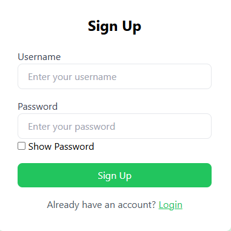
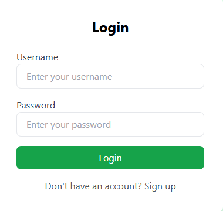

# Cloud Notepad

Cloud Notepad is a full-stack web application that allows users to securely create, manage, and organize notes online. It features user authentication, an admin dashboard, notifications, and activity tracking, all built with Node.js, Express, MongoDB, and EJS templating. The UI is styled with Tailwind CSS.

---

## Features

- **User Authentication:** Sign up and log in securely with hashed passwords.
- **Notes Management:** Create, update, and delete notes with tags and timestamps.
- **Notifications:** Admins can send notifications to users; users see new notifications on their dashboard.
- **Activity Tracking:** All user and admin actions are logged and viewable by admins.
- **Admin Dashboard:** View all users, their notes, activities, and send notifications.
- **Responsive UI:** Clean, modern interface styled with Tailwind CSS.

---

## Folder Structure

```
.
├── app.js
├── package.json
├── tailwind.config.js
├── public/
│   └── css/
│       └── style.css
├── views/
│   ├── admin-dashboard.ejs
│   ├── dashboard.ejs
│   ├── index.ejs
│   ├── login.ejs
│   ├── notifications.ejs
│   └── signup.ejs
├── .gitignore
├── README.md
└── note.txt
```

---

## Installation

1. **Clone the repository:**
   ```sh
   git clone <your-repo-url>
   cd INOTEBOOK
   ```

2. **Install dependencies:**
   ```sh
   npm install
   ```

3. **Set up MongoDB:**
   - Update the MongoDB connection string in [`app.js`](app.js) if needed.
   - The default is set to a MongoDB Atlas cluster; you can use a local MongoDB instance as well.

4. **Run Tailwind CSS (optional, for development):**
   ```sh
   npx tailwindcss -i ./public/css/style.css -o ./public/css/styles.css --watch
   ```

5. **Start the server:**
   ```sh
   npx nodemon ./app.js
   ```
   or
   ```sh
   node app.js
   ```

6. **Open your browser:**
   - Visit [http://localhost:3000](http://localhost:3000)

---

## Usage

- **Sign Up:** Create a new account with a unique username and strong password.
- **Log In:** Access your dashboard to manage notes.
- **Create Notes:** Add notes with a title, description, and tag.
- **Edit/Delete Notes:** Update or remove your notes as needed.
- **Notifications:** View notifications sent by the admin.
- **Admin Access:** Log in as `Admin` with password `Password` to access the admin dashboard.

---

## Admin Dashboard

- **View Users:** See all registered users and their notes.
- **Delete Notes:** Remove any user's note.
- **View Activities:** Monitor user and admin activities.
- **Send Notifications:** Notify any user with a custom message.

---

## Technologies Used

- **Backend:** Node.js, Express.js, MongoDB, Mongoose
- **Frontend:** EJS, Tailwind CSS
- **Authentication:** JWT, bcryptjs
- **Other:** body-parser, cookie-parser

---

## Environment Variables

- You can add a `.env` file for sensitive data (e.g., MongoDB URI, JWT secret).

---

## Scripts

- **Start server:**  
  `node app.js`
- **Start with nodemon:**  
  `npx nodemon ./app.js`

---

## License

This project is licensed under the ISC License.

---

## Author

- Mohammed Mehraj

---

## Screenshots

- SignUp page


- Login Page


---

## Notes

- For any issues or feature requests, please open an issue or contact [imastercharlie786@gmail.com](mailto:imastercharlie786@gmail.com)